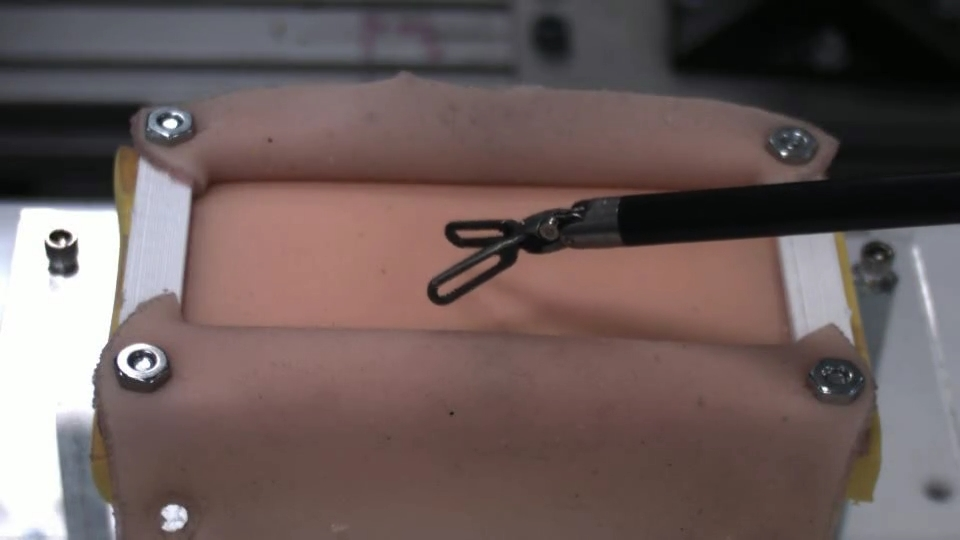
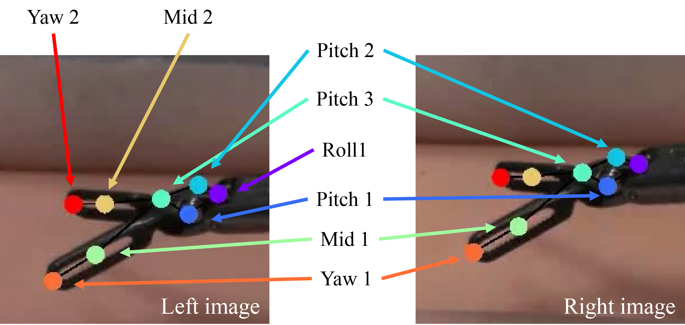
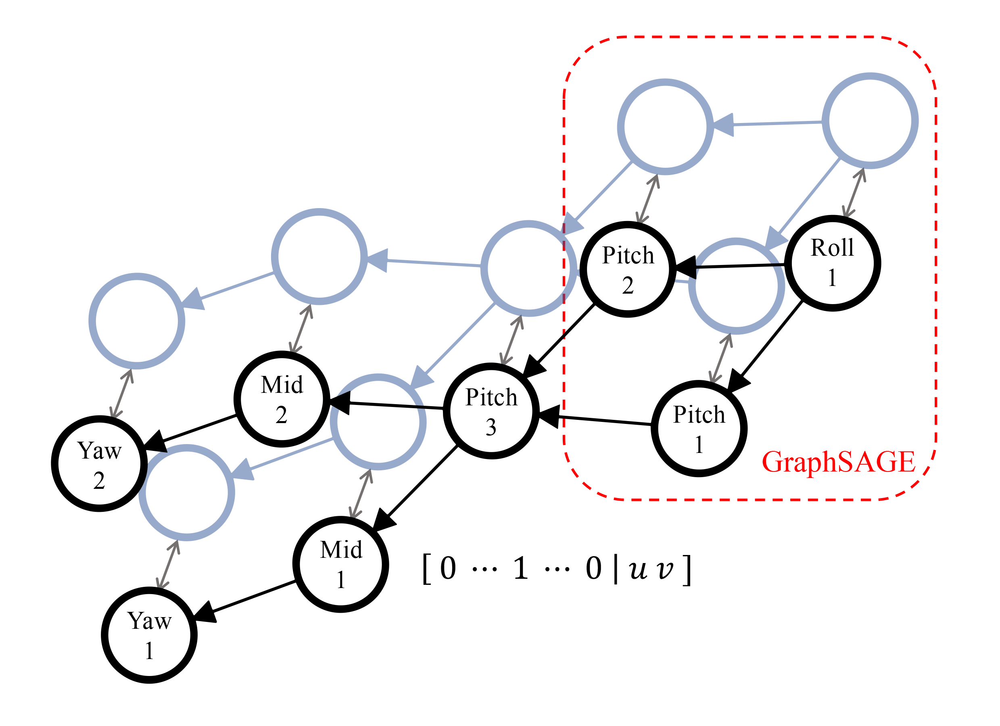
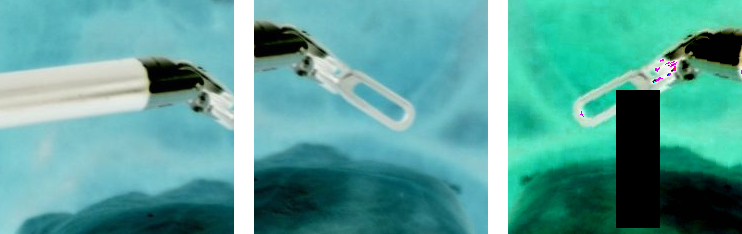
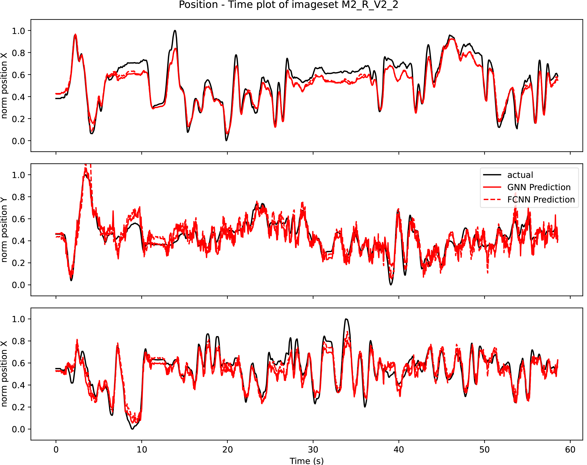

In scenarios where access to robot kinematic and camera parameters data is not available, this research devises an alternative approach to estimate a normalized 3D end-effector position from video data based on extracted keypoints from DeepLabCut. The movement of the end-effector is tracked from stereoscopic video of the surgical robot and then deep neural network (DNN) and graph neural network (GNN) are used to estimate the relative depth of the end-effector. 

## Sample of Dataset

## Keypoints Tracking and Usage in GNN

## Cropped and Enhanced Images for Contact Deteaction

## 2D Keypoints Coordinates -> 3D Positions of the End-effector

